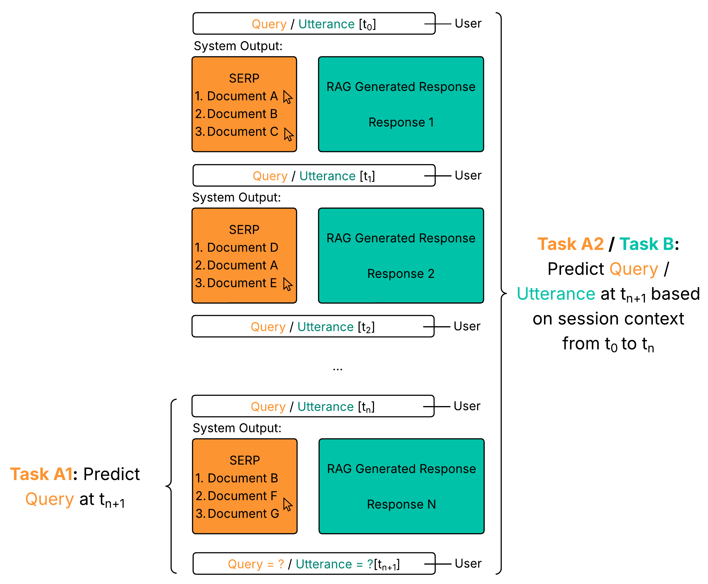

# Container Setup for Sim4IA - Micro Shared Task
Micro Shared Task for the Sim4IA Workshop at SIGIR 2025 - Data and SimIIR Framework will be available here on 16 May (AoE). 

This prototype is build upon the implementation of the . To facilitate experimentation with this setup, please follow the installation guide below. For easy installation, a Docker setup is used.





## Installation

1. Open the GitHub Repository in Codespaces
2. Download the Index from Sciebo and unzip the index into `example_data/index_CORE.zip` file into the `example_data/index_CORE directory.
```shell
curl -L -o index_CORE.zip "https://th-koeln.sciebo.de/s/F9AEa1CXyk2RTpf/download"
unzip index_CORE.zip -d ./example_data/
```

3. Build the container by executing:
```shell

docker-compose up -d --build
```
If the container has already been built, you can start it with:
```shell

docker-compose up -d

```
4. All dependencies should be installed automatically
5. You can access Docker shell via
```shell

docker exec -it SIM4IA_container bash

```
6. At the end of the session you should shutdown the container and delete the project from your Codespaces
```shell

docker-compose down

```

## About the data 

For both Task A and Task B, predetermined queries/utterances are provided in the repository to initialize the simulation with the original user inputs.
In Task A, the dataset also includes metadata about user interactions, including timestamps for each query and subsequent actions, that you might use for your query predictions.

[Predetermined Queries for Task A](./simiir/predetermined_queries_Task_A.csv)

##  How to do the experiments?

Detailed task descriptions for Task A and Task B are available on the . To run initial experiments for these tasks, follow the steps outlined below.

1. Adjust your query reformulation approach 
    - You can find existing implementations in `simiir/user/query_generators/` for Task A1/A2 and `simiir/user/utterance_generators` for Task B
2. Create a new user configuration that uses your query reformulation approach
    - Existing user configurations can be found in `example_sims/users/`
3. Add your new user configuration to the experimental setup
    - The setup for Task A1/A2 is located in `example_sims/core_bm25_Sim4IA.xml`   
    - The setup for Task B is located in `example_sims/core_Sim4IA_conversational_simulation.xml` 
4. Navigate to the `simiir` directory in the terminal
5. Run the configuration file with:
```shell

python run_simiir.py ../example_sims/core_bm25_Sim4IA.xml 

```
or
```shell

python run_simiir.py ../example_sims/core_Sim4IA_conversational_simulation.xml 

```

For the Conversational Search Task, an LLM is currently required for generating utterances. To run the simulation described above, follow the steps under "How to do the experiments with LLMs in Codespaces?" to set up and execute your chosen model.
If you decide to use a different model, make sure to adapt the configuration accordingly.

6. Instructions and a pipeline for the evaluation of your approach will follow soon. 


## How to do the experiments with LLMs in Codespaces?

1. Check Available Disk Space

Check how much disk space is available in your Codespace to determine which LLM model you can install.  
👉 See available models [here](https://github.com/BlackTechX011/Ollama-in-GitHub-Codespaces)
2. Access the Docker Container
Open a terminal and run:
```shell

docker exec -it SIM4IA_container bash

```
3. Start ollama
```shell

ollama serve &

```
4. Install and Run the Selected Model

Install and run the model you want to use (e.g., gemma:2b):
```shell

ollama run gemma:2b

```
5. Exit the prompt in the terminal with Ctrl + D

6. Configure Your LLM-Based Query Generator
Open the file example_sims/users/core_LLM_based_Queries.xml. This file is used to define how the LLM generates queries.
Make sure to update the following line to specify the model you want to use:
```xml

<attribute name="model" type="string" value="gemma:2b" is_argument="true" />

```
Replace gemma:2b with the name of the model you installed.

7. Add your user configuration to `example_sims/core_bm25_Sim4IA_LLM_approach.xml`
8. Navigate to the `simiir` directory in the terminal
9. Run the configuration file with:
```shell

python run_simiir.py ../example_sims/core_bm25_Sim4IA_LLM_approach.xml 

```


## License

This project is licensed under the MIT License - see the LICENSE file for details.


